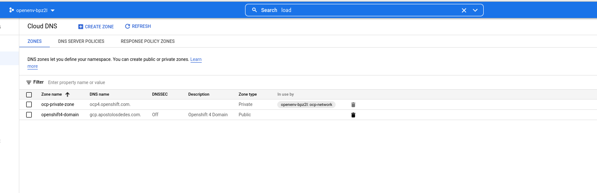

# Openshift 4.10.18 GCP Disconnected Installation on RHPDS

## Setup RHPDS Env

- [RHPDS Setup](#RHPDS)

Provision an RHPDS GCP Blank Environment using your RedHat SSO account. \
Choose "GCP Blank Open Environment". \
It has all the GCP billing, and quotas that you will need for your OCP 4.10.x cluster environment which consists of 3 masters and 3 2 worker nodes.

 
  

Follow the steps to the end and wait about 10-15 minutes until your environment is ready.

    

## Infrastructure Scripts 
***
The following directories contain the scripts in a numeric order to configure components. \
    You need to install the gcloud 

### [install_dir](#1-install_dir)

Contains the install-config.yaml which you will have to modify for your environment.

### [scripts](#2-scripts)
Contains all the scripts in a numerical order that I used to create infrastructure and environment.

### [ship-over](#3-ship-over)
Contains all the binary software that I downloaded on my laptop, made a tar and FTPed over to the bastion host on GCP.
    This is what I added. 

> mkdir -p ~/GCP/ship-over \
wget https://mirror.openshift.com/pub/openshift-v4/x86_64/clients/butane/latest/butane \
wget https://mirror.openshift.com/pub/openshift-v4/x86_64/clients/ocp/4.10.18/openshift-client-linux-4.10.18.tar.gz \
wget https://mirror.openshift.com/pub/openshift-v4/x86_64/clients/ocp/4.10.18/openshift-install-linux-4.10.18.tar.gz \
wget https://mirror.openshift.com/pub/openshift-v4/x86_64/clients/ocp/4.10.18/opm-linux-4.10.18.tar.gz \
wget https://mirror.openshift.com/pub/openshift-v4/x86_64/clients/ocp/4.10.18/oc-mirror.tar.gz \
wget https://mirror.openshift.com/pub/openshift-v4/x86_64/dependencies/rhcos/4.10/4.10.16/rhcos-4.10.16-x86_64-gcp.x86_64.tar.gz   

## Architecture

The following diagram depicts the OCP GCP architecture for the installation. \
All OCP nodes are COMPLETELY disconnected as well as the loadbalancers. \
The **ONLY** connectivity is from my laptop to the ocp-bastion host and **NOT**
the other way around.

  

## GCP Screenshots  

### [OCP Bastion Host](#ocp) 
___

### [VPC](#vpc) 
---
  

### [Subnets](#sub) 
___

### [CloudDNS](#cdns) 
___

### [Deployments](#dp) 
___

### [VM Instances and Instance Groups](#vmig) 
___

### [IP Addresses](#ipa) 
___

### [Firewall Rules](#fr) 
___

### [Cluster](#cl) 
___

